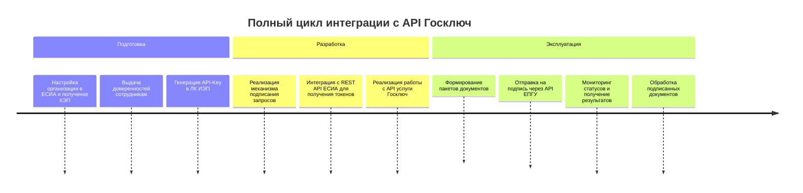
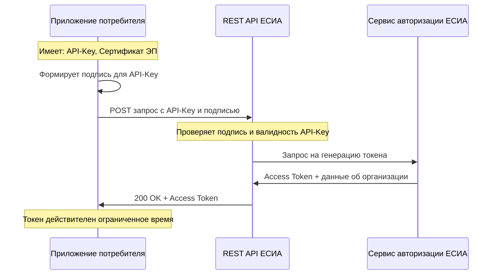
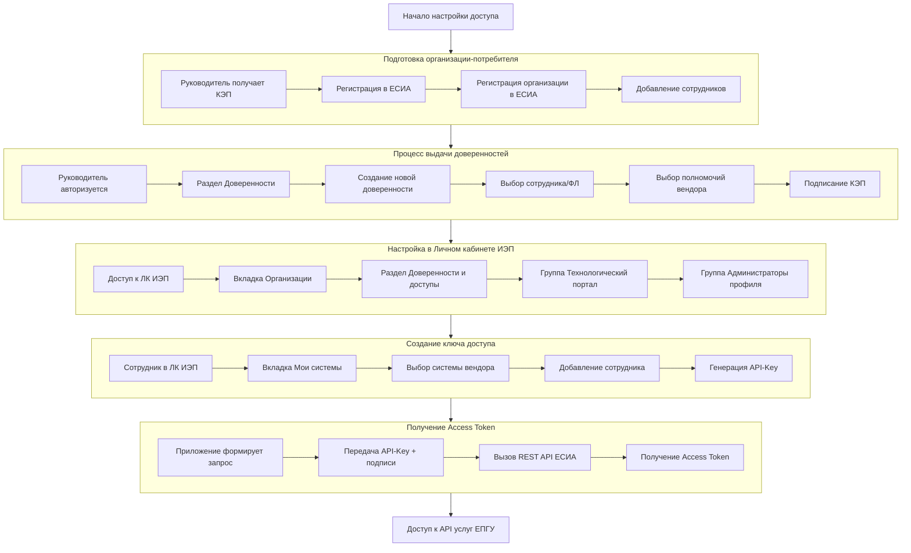

# Отправка документов на подпись в Госключ

## Полный жизненный цикл интеграции

Теперь разберем подробнее.

## 1. API "ГосКлюч" в контексте ЕПГУ: Общая схема доступа

Первый документ описывает не API самой программы "ГосКлюч", а инфраструктуру ЕСИА/ЕПГУ для доступа к государственным API, которым в данном случае и является API для интеграции с "ГосКлюч".

### Ключевые понятия:

API-KEY: Уникальный идентификатор (UUID), который выдается уполномоченному сотруднику организации. Это не пароль, а идентификатор, который используется вместе с электронной подписью для получения маркера доступа.
Маркер доступа (Access Token): Временный ключ, который ваше приложение использует для непосредственных вызовов API ЕПГУ. Получается путем обмена API-Key и подписи.
Организация-потребитель: Ваша организация, которая хочет использовать API (например, для отправки документов на подпись).
Организация-вендор: Разработчик ПО, который регистрирует свое приложение в ЕСИА и может предоставлять другим организациям право использовать его для генерации API-Key.
Основные шаги для получения доступа:

### Подготовка организации-потребителя:

- Руководитель организации должен получить квалифицированную электронную подпись (КЭП).
- Зарегистрировать подтвержденную учетную запись в ЕСИА.
- Зарегистрировать свою организацию в ЕСИА.
- Добавить сотрудников в организацию на портале ЕСИА.

#### Выдача доверенностей:

Руководитель через Личный кабинет юридического лица (ЛК ЮЛ) ЕСИА выдает сотрудникам доверенности на право формирования API-Key.
Сотруднику также выдаются права "Администратора профиля организации" и включается в группу "Технологический портал" в Личном кабинете Инфраструктуры электронного правительства (ЛК ИЭП).
Формирование API-Key:

Уполномоченный сотрудник авторизуется в ЛК ИЭП.
Переходит в раздел "Мои системы", выбирает систему вендора (которая дала полномочия) и генерирует API-Key для конкретных сотрудников своей организации.

#### Получение маркера доступа (Access Token):

Ваше приложение обращается к специальному REST API ЕСИА.
В запросе передается API-Key и подпись этого ключа сертификатом ЭП сотрудника или обезличенным сертификатом организации.
В ответ ЕСИА выдает Access Token, который используется для вызовов API услуг ЕПГУ.

## 2. Спецификация API для услуги "Отправка документов на подпись в Госключ"

_Суть услуги_: Ваше приложение (Внешняя информационная система) может через API ЕПГУ отправить пакет документов конкретному физическому лицу, чтобы тот подписал их в мобильном приложении "Госключ" (УНЭП или УКЭП).

## Ключевые моменты и ограничения:

- Кто может использовать: Руководители юр. лиц, ИП или сотрудники с специальной доверенностью.
- Получатель: Только один физический лице в одном запросе.

#### Требования к документам:

- Форматы: PDF, TIFF, XML, TXT.
- Не более 15 документов в одном запросе.
- Общий объем не более 100 МБ.
- Требования к архиву: Вы отправляете ZIP-архив, который должен содержать:

- req.xml — файл с метаданными в строгом соответствии с XSD-схемой.
- Файлы документов для подписи.
- Файлы отсоединенной электронной подписи (.sig) для каждого файла в архиве, включая сам req.xml. Подпись должна быть КЭП отправителя.

## Основные методы API (из Спецификации ЕПГУ), которые используются:

- POST /api/gusmev/order — Создание заявления (получение orderId).
- POST /api/gusmev/push или POST /api/gusmev/push/chunked — Загрузка архива с документами.
- POST /api/gusmev/order/{orderId} — Получение деталей и статуса заявления.
- GET /api/storage/v2/files/{orderId}/3/download?mnemonic={fileName} — Скачивание подписанных документов и подписей.

Жизненный цикл запроса на подпись:

- Ваше приложение, используя Access Token, создает заявление и загружает подписанный архив.
- Заявление получает статус 17 ("В очереди на отправку").
- Документы направляются в МП "Госключ" указанному получателю.
- Получатель подписывает или отклоняет документы в приложении "Госключ".
- Вы периодически проверяете статус заявления.
- При успешном подписании (статус 3 — "Документы подписаны") вы скачиваете файлы с подписями, полученными от "Госключ".

## Итог

API "ГосКлюч" для интеграторов — это не прямое API к мобильному приложению, а API ЕПГУ для услуги "Отправка документов на подпись в Госключ".
Для работы требуется пройти сложную, но стандартную для госсектора процедуру настройки доверенностей и получения API-Key через ЕСИА и ЛК ИЭП.
Процесс отправки документа на подпись строго регламентирован: требует формирования XML-запроса, упаковки в ZIP и подписания всего пакета КЭП вашей организации.
Это мощный инструмент для встраивания функций удаленной квалифицированной подписи через "Госключ" в корпоративные и государственные информационные системы.
Эти документы являются исчерпывающим руководством для начала интеграции. Рекомендую начинать работу с [тестовой среды] (https://svcdev-beta.test.gosuslugi.ru).

## Доп.материалы
- [Первый документ](Rukovodstvo_polzovatelya_dlya_organizacii-potrebitelya_po_formirovaniyu_API-Key_i_polucheniyu_markera_dostupa._Versiya_3.3_ot_31.01.2023_g.docx) — это общее руководство по получению API-Key и маркера доступа для работы с любыми API услуг на ЕПГУ.
- [Второй документ](Specifikaciya_API_EPGU_Otpravka_dokumentov_na_podpis_v_Gosklyuch_v1.8.docx) — это конкретная спецификация для использования одного из таких API — услуги "Отправка документов на подпись в Госключ".