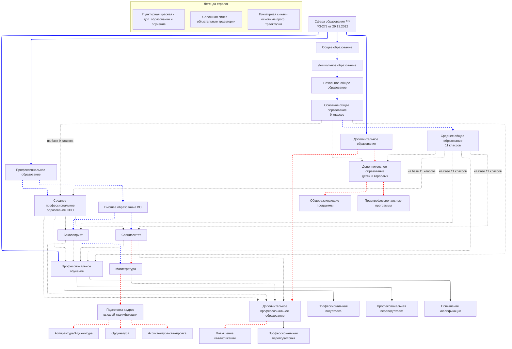

# Виды образования в Российской Федерации

Общественные отношения, возникающие в связи с реализацией права на образование, регламентируются **ФЗ № 273 от 29.12.2012 «Об образовании в Российской Федерации»**. Этот закон устанавливает **4 вида образования**:

- Общее образование
- Профессиональное образование  
- Дополнительное образование
- Профессиональное обучение

## Основные виды образования

Основными видами образования являются **общее** и **профессиональное образование**, каждое из которых реализуется по нескольким уровням, а также **профессиональное обучение**.

В РФ гарантируются **общедоступность и бесплатность** в соответствии с ФГОС общего и среднего профессионального образования, а также на конкурсной основе бесплатность высшего образования, если образование данного уровня гражданин получает впервые.

## Уровни общего образования

В РФ устанавливаются следующие уровни общего образования:

1. **Дошкольное образование**
2. **Начальное общее образование** (1-4 классы)
3. **Основное общее образование** (5-9 классы)
4. **Среднее общее образование** (10-11 классы)

> **Особенности:** 
> - Образовательные программы общего образования являются преемственными
> - Освоение программ дошкольного образования не сопровождается проведением промежуточных аттестаций и итоговой аттестации
> - Для зачисления на программу начального общего образования не требуется предъявления документа о наличии образования предыдущего уровня
> - Для всех последующих уровней общего и профессионального образования такой документ является обязательным

## Уровни профессионального образования

### Среднее профессиональное образование (СПО)

**Допускаются лица:**
- Имеющие среднее общее образование
- Имеющие основное общее образование (с одновременным получением среднего общего образования)

### Высшее образование (ВО)

**Структура высшего образования:**

| Уровень | Описание |
|---------|-----------|
| **Бакалавриат** | Первый уровень высшего образования |
| **Специалитет, магистратура** | Второй уровень высшего образования |
| **Подготовка кадров высшей квалификации** | Третий уровень высшего образования |

**Особенности:**
- Зачисление на программы ВО — конкурсное
- Для бакалавриата и специалитета требуется среднее (общее или профессиональное) образование
- Для магистратуры требуется высшее образование любого уровня

### Подготовка кадров высшей квалификации

**Виды программ:**

- **Аспирантура/Адъюнктура** — для научно-педагогических кадров
- **Ординатура** — для медицинских работников
- **Ассистентура-стажировка** — для специалистов в области искусств

**Требования:**
- Диплом специалиста или магистра — для аспирантуры
- Высшее медицинское/фармацевтическое образование — для ординатуры  
- Высшее образование в области искусств — для ассистентуры-стажировки

## Профессиональное обучение

**Направлено на:** приобретение профессиональной компетенции без изменения уровня образования.

**Подвиды профессионального обучения:**

- **Профессиональная подготовка** — для лиц, ранее не имевших профессии
- **Профессиональная переподготовка** — для получения новой профессии
- **Повышение квалификации** — для совершенствования существующих навыков

> Завершается итоговой аттестацией в форме квалификационного экзамена

## Дополнительное образование

### Дополнительное образование детей и взрослых

**Виды программ:**

- **Общеразвивающие** — для детей и взрослых
- **Предпрофессиональные** — в сфере искусств, физической культуры и спорта (для детей)

> Допускаются любые лица без предъявления требований к уровню образования

### Дополнительное профессиональное образование

**Виды программ:**

- **Повышение квалификации**
- **Профессиональная переподготовка**

> Требования: наличие или получение среднего профессионального и/или высшего образования

---

*Схема образовательных траекторий (Рис. 277):*

- **Синие сплошные стрелки** — обязательные образовательные траектории
- **Красная сплошная стрелка** — дошкольное образование (обязательное, но часто в форме домашнего обучения)
- **Синие пунктирные стрелки** — профессиональное образование и обучение
- **Красные пунктирные стрелки** — дополнительное образование, переподготовка и повышение квалификации

