# Организационная структура

# Типовое штатное расписание образовательной организации [(ВО, СПО, ДПО)](TypesOfEducation.md)

| Группа подразделений | Конкретное подразделение | ВО (Университет/Академия/Институт) | СПО (Колледж/Техникум) | ДПО (Институт повышения квалификации, Учебный центр) | Примечания |
| :--- | :--- | :--- | :--- | :--- | :--- |
| **Руководство** | Глава организации | Ректор | Директор | Директор | В ВО ректор может возглавлять университет, а директор — институт в его составе. |
| **Руководство** | Заместители | Проректоры (по учебной, научной работе и т.д.) | Заместители директора (по учебной, учебно-производственной работе и т.д.) | Заместители директора (по учебно-методической работе) | |
| **Учебно-административные подразделения** | Управление учебным процессом | Учебное управление (УУ) / Учебно-методическое управление (УМУ) | Учебная часть (УЧ) / Учебно-методический отдел (УМО) | Учебная часть (УЧ) / Учебно-методический отдел (УМО) | Ключевой центр организации образовательного процесса. |
| **Учебно-административные подразделения** | Подразделения по работе со студентами/слушателями | Деканаты (на уровне факультетов/институтов) | Отделение (во главе с зав. отделением) | Отдел (курс) слушателей | В ДПО, из-за коротких программ, деканатов обычно нет. |
| **Учебно-административные подразделения** | **Прием и маркетинг** | **Приемная комиссия**, Управление по профориентации и приему | **Приемная комиссия**, Отдел по профориентации и приему | **Отдел маркетинга и приема** | *Добавлено по вашему предложению.* В ВО/СПО — это часто временная комиссия, но ядро есть всегда. В ДПO функции "продаж" ярче выражены. |
| **Учебно-административные подразделения** | **Реклама, PR и работа с абитуриентами** | **Управление по связям с общественностью (PR)**, Пресс-служба, Отдел рекламы | **Специалист по PR и рекламе** (может быть в составе отдела профориентации) | **Менеджер по маркетингу** | *Добавлено по вашему предложению.* Занимается имиджем, новостями, рекламными кампаниями. |
| **Научно-методические и производственные подразделения** | Основные учебно-научные единицы | Кафедры | Цикловые комиссии (ЦК) / Отделения | Предметно-цикловые комиссии (ПЦК) / Кафедры | **Вы указали кафедры.** В СПО аналог — ЦК (например, ЦК информационных технологий). |
| **Научно-методические и производственные подразделения** | Научно-исследовательская работа | Научно-исследовательская часть (НИЧ), отделы аспирантуры | Обычно отсутствует или входит в методическую службу | Обычно отсутствует | Характерно для ВО. |
| **Научно-методические и производственные подразделения** | Производственная практика | Отдел практик / Управление по практикам | Отдел учебно-производственной практики | Отдел по связям с предприятиями | Важно для СПО и ВО. В ДПО связи с заказчиками. |
| **Научно-методические и производственные подразделения** | Методическая работа | Учебно-методическое управление (УМУ), Научно-методический совет | Методический кабинет / Методист | Методический отдел | Занимается разработкой и совершенствованием образовательных программ. |
| **Вспомогательные и обслуживающие подразделения** | Библиотека | Научная библиотека | Библиотека | Библиотечно-информационный центр | |
| **Вспомогательные и обслуживающие подразделения** | Информационные технологии | Управление информатизации / IT-отдел | Отдел информационных технологий | Специалист по IT-поддержке | |
| **Вспомогательные и обслуживающие подразделения** | Хозяйственное обеспечение | Административно-хозяйственная часть (АХЧ) / Хозяйственный отдел | Административно-хозяйственная часть (АХЧ) | Хозяйственный отдел | |
| **Вспомогательные и обслуживающие подразделения** | Ремонт и эксплуатация | Отдел капитального строительства и ремонта (ОКСиР) | Служба главного механика / энергетика | Часто функции переданы АХЧ | |
| **Вспомогательные и обслуживающие подразделения** | **Безопасность** | **Отдел безопасности / Служба режима** | **Специалист по безопасности / Служба охраны** | **Сотрудник по безопасности (охрана)** | *Добавлено по вашему предложению.* Отвечает за физическую, антитеррористическую безопасность, иногда за ГО и ЧС. |
| **Вспомогательные и обслуживающие подразделения** | Медицинское обслуживание | Медпункт / Студенческая поликлиника | Медпункт | Обычно отсутствует | |
| **Вспомогательные и обслуживающие подразделения** | Общежитие | Управление общежитиями / Студенческий городок | Воспитательный отдел (курирует общежития) | Обычно отсутствует | |
| **Подразделения развития и поддержки** | Международная деятельность | Управление международных связей (УМС) | Обычно отсутствует или входит в обязанности зам. директора | Очень редко | Характерно для крупных ВО. |
| **Подразделения развития и поддержки** | Воспитательная работа / Социализация | Управление по воспитательной и социальной работе | Социально-воспитательный отдел | Обычно отсутствует | |
| **Подразделения развития и поддержки** | Карьера и трудоустройство | Центр карьеры / Отдел по трудоустройству выпускников | Отдел по содействию трудоустройству выпускников | Отдел по взаимодействию с заказчиками | |
| **Подразделения развития и поддержки** | Дополнительное образование | Факультет/Институт дополнительного образования | Курсы профессиональной подготовки | Является основной деятельностью | Для ВО и СПО — это часто отдельное направление. |
| **Обязательные службы** | Бухгалтерия | Бухгалтерия / Финансово-экономическое управление | Бухгалтерия | Бухгалтерия | |
| **Обязательные службы** | Отдел кадров | Отдел кадров / Управление персоналом | Отдел кадров | Отдел кадров | |
| **Обязательные службы** | Юридическая служба | Юридический отдел / Правовое управление | Юрисконсульт | Часто привлекаемый юрист (аутсорсинг) | |
| **Обязательные службы** | Охрана труда | Отдел охраны труда (УОТ) | Инженер по охране труда | Специалист по охране труда | **Вы указали УОТ.** |

```mermaid
---
config:
  layout: elk
---
flowchart TD
    A["Образовательная организация"] --> B["Руководство"] & C["Учебно-административные подразделения"] & D["Научно-методические подразделения"] & E["Вспомогательные подразделения"] & F["Подразделения развития"] & G["Обязательные службы"]
    B --> B1["Ректор/Директор"] & B2["Проректоры/Замы директора"]
    C --> C1["Учебное управление/Учебная часть"] & C2["Деканаты/Отделения"] & C3["Приемная комиссия"] & C4["PR и реклама"]
    D --> D1["Кафедры/Цикловые комиссии"] & D2["Научно-исследовательская часть"] & D3["Отдел практик"] & D4["Методическая работа"]
    E --> E1["Библиотека"] & E2["IT-отдел"] & E3["АХЧ"] & E4["Безопасность"] & E5["Медпункт"] & E6["Общежития"]
    F --> F1["Международные связи"] & F2["Воспитательная работа"] & F3["Центр карьеры"] & F4["Дополнительное образование"]
    G --> G1["Бухгалтерия"] & G2["Отдел кадров"] & G3["Юридическая служба"] & G4["Охрана труда"]
     B1:::vo
     B2:::vo
     C1:::vo
     C2:::vo
     C3:::spo
     C3:::dpo
     C4:::spo
     C4:::dpo
     D1:::vo
     D2:::vo
     D3:::vo
     D4:::spo
     D4:::dpo
     E1:::spo
     E1:::dpo
     E2:::spo
     E2:::dpo
     E3:::spo
     E3:::dpo
     E4:::spo
     E4:::dpo
     E5:::spo
     E6:::spo
     F1:::vo
     F2:::spo
     F3:::spo
     F4:::spo
     G1:::spo
     G1:::dpo
     G2:::spo
     G2:::dpo
     G3:::spo
     G3:::dpo
     G4:::spo
     G4:::dpo
    classDef vo fill:#e1f5fe
    classDef spo fill:#f3e5f5
    classDef dpo fill:#e8f5e8

```

